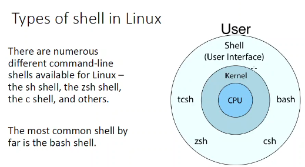
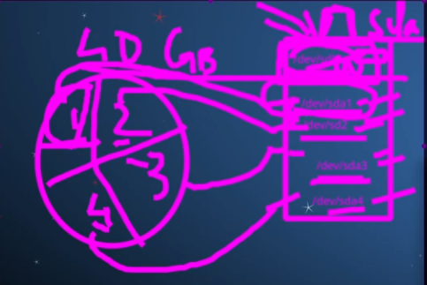
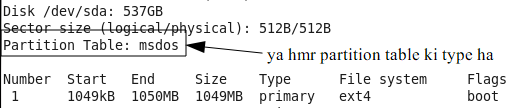
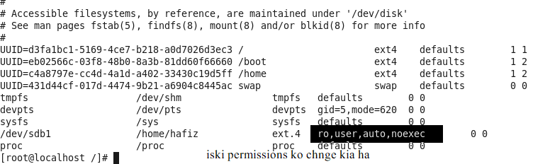

# Most famous operating systems
1- MAC\
2- WINDOW\
3- LINUX\
4- UNIX\
5- BSD(Berkeley Software Distribution)

# Why linux
- its secure
- we can use this in old computers easily
- perfect for programing
- fast updates
- customization
- variety of distributions
- free to use
- its open source means its free
- better community support
- Reliability
- privacy
  

## How does linux is deffer from other operating systems?
 

>**Live CD distribution**

A live CD and DVD is a CD-ROM or DVD-ROM contaning a bootable operation system.

>Difference between UNIX and LINUX


# Who uses Linux
Every big company in the world using Linux as main proparitary operating system\
1- Facebook\
2- Microsoft\
3- Google\
4- Amazon\
these 4 big company use linux continuesly.
>Who "own" Linux
- linus Benedict Torvalds
  
 

 > **importance of linux**

 
  
  All IOT(internet of things) things are using linux 
  differents hacking distros\
  autonomous driving also uses on linux
  
  
  - ALL machine learning tools are using 99% linux
  - Deep learning tool are alomst 99% use linux
  - AI also use 99% linux
  - Cloud computing also use linux
  - satellite is also use linux operating system
> **contribute to linux**


# **linux primer**


> **What is linux?**

 
 ```
 Distrowatch.com 
 here is all the linux distribution we can see all the distribution of linux by using this website.
 ```
 > Linux kernal

 

 > Smart phones and linux

90 to 98% market phones ki andrioad ka pas ha because ya bht sasta ha or ya linux operation system use krta ha

>More on distro


----

---

----


# **Linux Primer**
>Livepatch

baisecally this is use to automatically update of new version we can aso do this manually\
*CLI(command line interface)*
---
---

---

# Starting of machine commands.
- `cd` is used to change diectry.
- `cd ..` is used to go back to the previos directry
- `rm` is used to remove any file
- `ls` is used to show list
- `ls -l` , `ls -lh` is used to long lasting list, detail list but ls -lh show us the storage of directry
- `cd /bin` is used to see all the commands
- `cd /dev` is used to see the development things
- `etc` command show whole of the configation
- `sbin` command is used to see all the useful commands. only super user can use this commands
- `tmp` this command is use to see all the temporary files
- `mkdir` is used to make directry 
- `rmdir` is used to remove directry
- `cd ~` is used to go to home directry
- `rm` is used to remove file
- `touch filename` is used to make a new file
- `sudo -i` is used to switch to simple user to root 
- `mv file name`  is used to rename any file
- `cat` command is used to see what is in the file.if i want to view in any file we can use this command
- `sudo -i` command is used go to the root
- `su` this command is used to switch user
- `chmod u+x file name` this command is used to give full permission to any file.
- `chmod g+x groupname` this command is used to execute permission to any group.
- `chmod o+x` this command is used to give permission to everyone.
- `chmod u+x,g+x,o+x filename` this command is used to give permission to all privilliges.
- `chmod u-x,g-x,o-x filename` this command is used to take away all the permission from privilliges\

- `ls -l >> filename` this key is use to creat a new file.
- `touch filename` is used to directing all the input to that file.
- `cat -b filename` is used to see number of lines.
- `head filename` his command is used to view the begning of the text file.
- `head -n documentname` this command is used to view the numbers of line(such like if we want to see first 10 lines we have to write head -10 filename).


`grep` command is used to show this list of thata data which we want to see.


> ls >   file is use to list all file and collect their data in the given file it also delete the data of given file.

>ls >> this command is also use for list all file and their data in the given file but in this the data not lost it add the all data in a file

## Linux file system 
file system mean how to organize a file


## Different between kali and ubuntu linux
Ubuntu ma ham default user hota ha or kali ma ham by default root user hota ha.
kali is used for super user or root user because we have to run all the command in kali linux.\
if we run all these command in ubtuntu that will not run. its show that permisson denied.
- the name which name is typed in blus is directry and which is in white is file.

# Root
Root basically a superuser which can do any work on machine. we can do all task on root which we cant done on defaut user.
- **absolute path** 
  kisi b directry ma sa kisi or directry ma file ko remove kr skta ha absolute path sa.
  # **Archive and Compressing file**
  
* **tar -cf filename.tar ~/Documents**\
This is used to zip as it file its does not compress the file the file convert in the zip as its current size
* **tar -cvf filename.tar ~/Documents**\
This is used to zip any file its also compress the file size. its is very good command if want to compress the file.
* **tar -czvf filename.tar.gz ~/Documents**\  
  its work very neatly .its pack the file very clearly and gives us the output very clearly.
-----
\
use for that file which is compress with ".gz"
* tar -xzvf filename.tar.gz
  basically vf is used for variety of functions
----

* for zip any file we use "zip -r filename ~/Doucement".
* for unzip any file use "unzip filename.zip"
  
  # While card
This is used to delete multiple files.basically while card is defined with a "?" in superuser. we have to use to while card with extenshion "?.txt"(rm filename?.txt)
 - Asterisk this also a while card its also use tp delete all data from files.its symbol is " * "
(rm *filename.txt) 
# Linux user types


## Standard user nd root user
* Standard user is a simple user. its a default user we cannot run all commands in it.
* Root user basically a admin user we can run all the file in root. we have to work in root very carefully. because if any file delete then its permanenty delete.

> **vi passwd** is used to modify in passwd command if we open it so we have to come to pervious directry by using "Esc then :q " 
>  * basically "vi" is used for modification.

## Shadow
"cat shadow" is used to show the file data. we can open this file by using root used we cannt open this file on kernal."cat" use for to shoe any file."*" in shadow astric mean we cannot login with this account as a system because that is not a system login account.
* **gshadow** in this file all the paswords are store in incripted foam.
## Group
"cat group" by using this command we can see all the groups and users.
* add group\
  \
  to move any group ("usermod -G groupname move group name ")
  
  * remove a user from group
  \
  * delete any group\
  
----
# Add user
* We can add user by typing "useradd username" we can only do this on root user. its not work on standard user
* if we want to give home directry to new user then type "useradd -m username"
* if we want to give access of bash and bin then (useradd -m -s "/bin/bash" username)
   

# delete user 
* for delete user just type "userdel username"

# Password change 
"paswd username" by using this commant we can change the pasword of any user but we can only change pasword from root user
# if we want to block/lock acces of any user then
\
usermod -L username 
* For unlock/unblock any user\

# if want to change user name then
\

# if we want to delete the user also from home directry then 
userdel -r username
* **use "exit" for come out from root user to standart user** 
-----
# Different between kali and ubuntu 
* In kali user are admin by default.
* in ubtuntu user are standerd by default.
  
# SU command

su is used to switch users if we want to go from one user to other without termination the sesion
## sudo command
sudo stand for "switch user do"
## modify any used 

# Groups
basic purpose of the group is to simply the management of the groups
* first group is primary group which have normal users
* 2nd group is admin group\
 

----

# how to view logs files

# sudoers 
"cat sudoers" is used to see all the groups and their access
# group idz
"cat passwd" is used to see all the group idz
# Chnging ownership
for change the owner of any file we have to use this command (chown newname foldername)
* we can chnage the owner by using this command
\

* for change ownership from a standard user without changing the user

# changing group 
for change the group\

* changing group from standard user 

# how to search for a specific name within a file
is ma hm kisi b file ma sa special words ko dkh skta h ya kisi pargraph ma sa words ko search krna ka lia use rta ha\

# Display less commands 
`less filename` 
agr ham file ko thora thora kr ka dkhana chahta ha tu ya command use kr ka hm dkh skta han. end ka bad is file sa exit ka lia `cntrl+z` press krna para ga.
# Editing text file 
agr hm kisi file ma likhna chahta hain ya edit krna chahta ha tu `vi filename` command sa hm us file ko edit kr skta ha or is file sa bhr ana ka lia `Esc+ shift+: is ka bad q` likh ka file sa bhr ae skta ha agr hm us file ko save b sath krna chahta ha tu `shift+: is ka bad wq` sa kr skta ha.
# what is IP adress
IP stand for internet protocol. kisi b device ko internet pa jana ka lia ip adress ki zarorat hoti h.its a network acces for our computer.
`ip addr show` ip adress dkhna k lia ya command use ki jati h. IP adress ko ham setting sa ja ka b dkh skta ha.
* DHCP stand for domane host configration protocol
  # ifconfig
  is command sa IP wgra show hota ha or
  ya ubunto ma default instal nhi hota hma ya install krna prta ha `sudo apt install net-tools` is command sa hm esa install kr skta ha.agr ham root sa install krta h tu sudo nhi likha ga.agr ham is ma sa koch chzian dkhna chahta ha tu hm `ifconfig | grep specificword` tu hma ya us words ki sari details show kr da ga.
  # finding default gateway
  default gateway asi chz h jis sa hama pata chlta ha ka hm internet pa kaha ja rha ha.`ip route` sa hm gateway dkh skta ha
  # dhclient
  `dhclient` ya command RTNETLINK file dkhna ka lia use hoti ha agr apka pass manually DSCP(Differentiated Services Code Point) server ha tu. DSCP classify or network traffic ko manage or quaity of service provide krna ka lia use hota ha. agr ham apni ip ko release ya chnge kerna chahta ha tu `dhclient -r` sa kr skta ha
  # what is ping
  A ping (Packet Internet or Inter-Network Groper) is a basic Internet program that allows a user to test and verify if a particular destination IP address exists.
  ham es sa bhr ana ka lia `cntrl+z` ko use krta ha.
  
  # Disk space usage
  `df` sa ham dkh skta ha k konsi drive ma kitni space ha or konsi konsi drive na kitni space cover ki ha or kitni baki ha. agr giga bite ya mega bite ma space dkhni ho tu hm `df -h` use krta ha
# For checking the permission of any directry or target file
`du -sh /var` ya command use kr ka hm kisi b file ya directry ki permission dkh skta ha. or ya hma var ki size dkna ka lia use hota ha
# unmounting removable media disk
is sa hm kisi b media sa data ko unmount kr skta ha isa use krna ka lia `unmount /media /USBdrive` is sa hm kisi b drive ko un mount kr skta ha.\

**forcing usb to unmount**
agr hmra pass koi file open ho tu hm unmount kra to wo phla opetion da ga k phla files bnd kra is ka lia hm forcing unmount ki command use kr ka usa bnd kr skta ha `unmount -f /media /USBdrive`
# Process in linux
linux ma process aik asa procedure ha jis ma ap spacific task kr skta ha
* `ps` ma hm running process dkh skta h jo process hora hta ha basically ya itna kam ki comand nhi ha but ya hma default ma 2 process dkhae ga (bash,ps)\
  
* But agr hm `ps -e` use krta h tu ya hma extent runing sari process dkhta ha jo k extandard version m hoti ha
* agr ham is ko listing ki trha dkhna ha tu hm `ps -el` sa dkh skta ha
* agr ham listing ka sath uski dates b dkhna chahta ha tu hma `ps -elf` use krna para ga
  # Top
`top` command aik standard command ha. ya bht useful command h agr hm linux ki maintainess krta ha tu.is sa pata chat jae ga ka cpu memory kon zyda istamal kr ra ha. is ma cpu% ma btya jata ha time btya jata h or ham command kon kon sa use kr skta h. ya kis command sa kon kon sa kam hoa ha
- agr koi process background ma chal rha ha tu hm us ka PID nmbr dkh ka "kill" cmnd sa usa bnd kr skta ha  
# Different between linux and window
- linux ma apka pass zyda powerfull applications h. apka ps control zyda h "CLI" ka.
- jbka window ma is chz ko  ht minimize kia gya ha
- linux ma code apka smna hota h jisa manipulate kr skta h chnge kr skta ha
- jb ka window ma asa bilkul b nh ha
- dono ma software pakage intalliation ka bht different ha window ma hm setup file sa install krta ha jbka linus ma instal krna ka tarika or hota ha
  # installization
  agr ham linux ma koi chz install krna chahta ha tu us ka lia `dpkg -i installer.deb name`
  agr koi chz remove krna chahta h tu hm `dpkg -r installer.debname `
  # installing advance pakage tools 
  agr ham koi pakagr install krna chahta ha tu hm 
  `apt-get install(pakage name )`
  isi trha ham agr kooi pakage remove krna chahta ha tu ham 
  `apt-get remove(pakage name)` ya command use kr ka remove kr skt ha
  **installing RPM pakages**
  `rpm -i installer.rpm`
 agr ham rpm ki koi b file pkg install krni h tu is trha sa hm usa install kr ksta ha
 * `rpm -e installer.rpm` ya command use kr ka hm us isntall file ko rmove kr skta ha
  
# YUM (Yellow dog updater)
basically yum b kisi pakage ko install krna ka lia use hota ha hm esa use kr ka pakage intall kr skta ha `yum install(name of pakage)`
agr hm same command use krta hoa kisi pkage ko uninstall krna chahta h tu `yum remove(name of pakae)`
# Apropos ext3
agr hama koi help chae tu hm is commad ka use kr skta ha. basically ya linux ka buliding manual ha jisa hm use kr skta ha
# Man nslookup
man page basically aik manual page hota h jisa hm apna hisab sa managae kr skta ha maintain kr skta ha. programer isma command store kr skta ha
is sa exit ka lia hm `q` ka use krta ha
# **Linux level 1**
 
## Pwd 
`pwd` sa ham apni location dkh skta h ka hm kis jaga pa ha mtl kis directry ma ha.
# word count
`wc` use kr ka ham word ko count kr skta ha\

# How to make multiple file 
multiple files bnana a lia `touch filename{1....100}`likha ga tu 100 files bn jae gy. ya kam hm root pa rah ka kr skta ha. standard user pa ya kam nhi ho skta
# Folders distribution
\
sb sa phli file father file hoti ha us ka bad dosri files ati ha jis directry khta ha us ka bad us sa nicha wali files ko sub-directry kahta ha. or ham path ka use kr k file to file ja skta ha. 
# id 
`id` commad sa ha apna user dkh skta ha is ssa hama pata chlta ha ka hmna konsa user sa login kia ha.
- isi trha `whoami` sa b ham same dkh skta ha but is sa hma sirf ya btata ha ka hm na kha sa login kia ha.
# snapshot 
is sa ham backup m aik file creat kr skta ha. agr hmri machine crash ho jae tu hm yha sa usa whi sa run kr skta ha. ya file aik trha sa backup ka lia use hoti ha.
# Lost+found
is folder ma hmri recover files ati ha jo hmri del ho jati ha jb usa recover kia jata ha tu is file ma ata ha.\

# Copy paste and edit 
 `vi` ko use kr ka hm kisi b file ko edit kr skta ha or file ma sa del krn ka lia `dd` double ta krna prta ha d ko copy k lia hm `yy` istamal krta ha or paste ka lia hm `p` word ko use krta ha is sa hmri. file ma enter hona ka bad insert mode `i` sa hm file ko edit kr skta ha mtlb usma koch likh skta ha.
 
 - words ko replace krna k lia or password file protect k lia\
  
  - we can protect key by using vim command after enter in the file we have to `Esc` button and then we have to press `cntrl+x` then hma pasword set krna ha.
# Softlink and hard link
soft link ko hm kisi b file sa link krna ka lia use krta ha is sa hm aik directry sa dosri directry a b link bna skta ha is ka lia `ln -s ` ki command use hoti ha jis sa hm. agr hm isi parent file ko delete kr da tu data child file sa  rmv ho jae ga. soft lin k inode nmbr different hota ha losg listing ka dosran '-->' sa link shw krta ha. is ma arrow sa pata chal jata ha ka konsi file kis sa link ha !
- symlinks can cross partitions
- 


## Hard link
 hard link ko bnana ka lia `ln` ka istamal krta ha . hard link ma hm `-s` ko istamal nhi krta or is ma hm kisi dosri directry sa file ko link b nhi kr skta. isa bs hm apni same directry ma link kr skta ha. agr hm iski parent file delete kra ga tu data child file sa b rmv nhi ho ga. hardlink ka inode nmbr same hota ha. ya one time of backup sa b jama jata ha. is ma sa agr paarents file sa data remove kr d tu child file sa data rmv nhi hoga. is ma link uski listing krna par starting nmbr sa dkhta ha.is ma hma pata nhi chkta konsi file kis sa link ha. `ls -il` sa inode number ka sath list sa link file b dkha dta ha\
 

 
 agr hm `find /usr/ -inum inodenumber` likha tu hma ya uski details btae ga ka konsa file kis sa link ha.mtln unka inode nmbr aik hi ha or wo sari aik dosra sa link h. or ya sb hm same directry ma rah ka kr skta ha
- hardlinks cannot cross partitions\
  

  ls -l sa ham inki long listing dkh skta ha 
  ### inod
  inod nmbr basically file ki properties ko apna pas save rkhta ha. inod dkhna ka lia `ls -i` ki key use kr ka dkh skta ha. hr file ka aik specific inod nmbr hota ha
  
  `ls -il` sa hm iski long listing check krta ha. jis sa hama links ka relate sari information dkhta ha.inod nmber jasa hi hm file bnta ha usa assign ho jata ha or inod aik unique nmbr hota ha. inod number ka jo father hota ha usa `inode table` khta ha. inode table ka jo father ha usa `super block` khta ha or jo inode table ka jo father ha usa `file system` khta ha.
  hr partation pa depend krta h ka uska inode kitna ha. agr ham dkhna chahta ha ka partiation kitna ha tu  `df -i` sa dkh skta ha.  

# Partitions
basically partitions hard drive ko devide krna ko khta ha partition creat kr k hm hard drive ko chota chota hisso ma divide kr skta ha or hr hisa ki aik specific storage or place rkh skta ha 


# how to creat hidden files 
hm linux ma hidden file  bna skta ha jisa ham `touch .filename` sa bnta ha. isa ham "ls" kr ka list nhi kr skta isa list krna ka lia ls ka sath a likh ka hm isa list kr ksta ha `ls -a` sa hama sari regular or hidden dono dkhae ga. agr hma hidden file ka inode dkhna ha tu hm `ls -ia` command use kraa ga is sa sari regular file ka sath is ka b inode nmbr dkhae ga. agr ham sirf hidden file ka inode dkhna chahta ha tu `ls -ia .filename` ya command use kr ka dkh skta ha 

# copying files in linux
`cp` command sa ham backup la skta ha kisi b file ka or wo hm different locations pa la skta ha. backup wo hota ha jisa ham kisi dosri location ma rakh skta ha .is ki command `cp <filename> <path to copy>`. is sa hm kisi b file ko copy kr skta ha ya backup kr skta ha. is sa ham kisi b directory ko copy nhi kr skta .cp command sa hm kisi b partation ma backup la skta ha

* agr hm kisi directory ko copy krna chahta ha tu hma cp ka sath `-r` use krna ha.
  ## mv
`mv` commad sa hm kisi b file ko cut ya paste kr skta ha isa copy krna ka lia full path dia jata ha.is sa file ko move  kr skta ha.\

## 2nd mv
`mv` command sa ham cut paste ki ki bjae hm is sa name b chnge kr skta ha but is ka lia hama full path nhi dana prta is ka lia hm `mv filename chngfilename` kr ka hm isa change krta ha 

# chapter 5 
# Installing RHEL 7-8 Ownership Permission Overview

- phla ham osboxes sa centos ki image ko downlod kra ga then usko virtul box ma run kra ga.

### 5.1: check centos version
- m apna centos machine ka version b root sa check kr skta ha ka hm is ka konsa version use kr ra ha.
-  `cat /etc/redhat-release` is command sa hm centos k version dkhta ha.
- kisi version ma redhat ksa name sa file nhi hoti us ka lia ham `cat /etc/os-release` use krta ha.

### 5.2: architecture
- agr hm centos ka architecture dkhna chahta ha tu hma `arch` command use krni hogy.
-  is ka ellwa b commands ha jis sa hm is ka architecture dkh skta ha.
-  `uname -m` ya command b arhitecture ka lia use hoti ha 
### 5.3: linux kernal
- linux ma kernal ka version dkhna ka lia b command use hoti ha jis sa hm apna linux kernal ka versoin dkh skta ha.
-  `uname -r` iski command ha.
-  
## 5.4: ownership and permission
- sb sa phla ham opt ma jae ga then ham opt ma aik file creat kra ga.
 
- is picture ma 2,5,6 ya fields ha file ki or isma 2 peermissions ha file ki jo jo file ko permissions di gy ha.
- organization ma user ko right nhi hota ka wo sb koch access kra.
- principle of least privilege ka jo concept ha apko user ko uthna hi access da ga jitna uska kam ha\
#### 5.4.1:Bit

\
- basically ya bits ha "-" ka mtl bit off ha 
\
- jitna hiffens hoga uthna hi bits off hogy mtlb uthni permissions off hogy "---" ka mtlb is user ko koi permission nhi ha.
- "rwx" ka mtlb is user ko read write and execute ki permission ha
- isi trha dosri b ha agr kisi ko write ki permission ha tu -w- likha hoga is ka mtlb baki permissions off ha is ki. 
- agr --- haffens ka sath kisi user ka name ata ha jasa ka "--- umar"
- iska mtlb is user ko koi permission nhi ha\

- binary form ma "000" ka mtlb nill permission hot ha jbka "111" ka mtlb full permission hota ha. 
 ### 5.4: POLP(principle of least privilege)
 - The principle of least privilege (PoLP) is an information security concept which maintains that a user or entity should only have access to the specific data, resources and applications needed to complete a required task.
 ### 5.5: Types of fields
 - jb ham kisi file ki properities ko janana ka lia "ls -l" krta ha tu iski properties 9 fields ma distribube hoti ha .
 - \
 - is ma sari fields ko explain kia gya ha. 
 - agr ham koi user bnata ha tu us ka aik alag group bn jata ha bydefault 6 field hma wo group dkhati ha
 
 - total 9 fields h jo 3 3 bits kr k divided ha phli 3bits owner y user ka lia 2nd 3bits groups ka lia or 3rd 3bits others ka lia
 
 
 ### 5.6: how to change owner 
 * `chown`
- agr hm kisi b user k owner change krna chahta ha tu hma us ka lia ham "chown" ki commant use kra ga or owner change ho jae ga.

`chown newuser olduser`
- is trha kr ka hm kisi b user ka owner change kr ksta ha.
  * `id` username sa hm user ka id dkh skta ha new user bana ha ya nhi
### 5.7: group and user 
- jo user hota h wo single bnda hota ha\
- or jo group hota ha multiple users hota ha
   

##### 5.7.1: how to change user permission
`chmod u+rwx username`
- is command ko use kr ka hm kisi b user ki permissions ko chnge kr ksta ha agr kisi user ki permissions ko off krna ho tu us ka lia `chmod u-rwx username`
- is trha kr ka hm uski permissions ko rmv kr ksta ha 

##### 5.7.2: Groups perrmissions 
- agr hm kisi groups ki permission ko chnge krna chahta ha usa koi or permission dna chahta a tu us kia lia `chmod g+rwx groupname`
- or isi trha hm permissions ko rmv krna chahta ha tu command ma + ki jga - use kkr ka hm kr skta ha
## 5.8: Types of files
- file ki 7 types hoti ha linux ma.
#### 5.8.1: Regular file
- agr kisi file ki properties ka start ma "-" aera ha tu is ka matlb ka wo aik regular file ha.
#### 5.8.2: Directry
- agr kisi files ki properties ka start ma "d" ata ha tu is ka matlb wo directry ha 
#### 5.8.3: symlink
- agr kisi file ki properties ka start ma "l" ata ha tu is ka mtlb wo aik symlink file ha
#### 5.8.4: Block file
- agr kisi properties ka start ma "b" ata ha tu is ka matlb wo aik block file ha
#### 5.8.5: Character file
- agr kisi file ki properties ka start ma "c" ata ha tu is ka mtlb wo aik character file ha
#### 5.8.6: Socket file
- agr kisi file ki properties ka start ma "s" ata ha tu is ka mtlb wo aik socket file ha.
#### 5.8.7: Pipe device file
- agr kisi file ki properties ka start ma "p" ata ha tu is ka mtlb wo aik pipe device file ha


**5.5.1: field link account**
hr file ka lia link account 1 hota ha jb ka directory ka lia link account alag hota ha
**5.5.2: field**
is filed ma hm file ka size dkhta ha 


# Chapter 6: Edit Ownership permissions


## 6.1 Editor
- hma kam krta hoa at the end hma configration krni prti ha web server ksa chla ya gmail ksa work kra tu us k lia ya day to day ka kam ma ata ha is ka lia hma editor pa kam krnaa ana chae.
- `vi,vim` ya sb sa powerful editors ha. kisi b admin ko aik editor pa kam ana bht zarori ha. 
- agr hma atleast 15 sa 16 mode pa kam krna ae jata ha tu hm kisi b trha ka task configration ka ya editior ka hm easily kr skta ha 
#### 6.1.1 Vim
- is commad ko use kr ka hm kisi b file ko edit kr skta ha.
agr hm isi b file ko open krna ka bad uski line ko dkhna chahta ha ka kitni line ha file ma tu us ka lia hm `esc press krna ka bad collon lgae ga pir set nu` ki command sa hma wo file ki line show ho jaen gy
 
- agr hm number of line ko bnd krna chahta ha tu `set nonu` ki command use e k kara ga 

- agr hm kisi specific number of line pa jana chahta ha tu hm collon k bad line ka number put kr da.

- agr hm vim mode ma kisi specific word ko search krna chahta ha tu hma `esc ka bad /word` likhna hoga.
-  isi trha kr ka hm kisi b specific word ko search out kr skta ha.agr same word ho yani ka usi name ka or b words ho tu us ka lia `n` press kr ka next next word tk shift ho jae ga.
-   agr ap agla word pr chla jata ha or back wla pa ana chahta ha tu `shift+n` sa hm ak step back ae jaen ga 
- agr ham aik hi file ma 2 windows pen krna chahta ha tu us ka lia hma `esc ka bd shift+: or vsplit` ki command use krni hogy is sa wo hma 2 window dkha da ga
agr hm 2 sa zyda windows ma at a time kam krna chahta ha tu hm `shift+: vsplit` again kra ga tu aik or window open ho jae gy
>agr hm aik hi window ma multiple file ko krna chahta ha tu us k lia `esc shift+: split filename ya path` is sa wo file ma same windoe ,ma open ho jae gy


 * agr hm aik file sa dosri ma jana chahta h tu us ka lia `cntrl+ww` kra ga tu curser agli file ma chla jae ga 
 * agr hm kisi b file ko close krna chahta ha ya quit krna chahta ha tu hm `shift+: q` sa kr skta ha is sa wohi file quit hogy jisa hm edit kr ra hota ha.
  
 - agr hm kisi file ka password set krna chahta ha tu hm vim ma jana ka bad `shift+:X` ka bad password type krta ha us ka bad `wq` quit krta ha
 - isi trha hm kisi b file ka passwd ko rmv krna chahta ha tu hm vim sa file editor mode ma open kra ga then `shift : X` kra ga tu wo passwd ka show hoga us ka bad hm `2dfa enter kra ga without passwd ` then wo passwd rmv ho jae ga.us ka bad `wq` sa quit kr dana ha.
 #### 6.1.2: nano
 - ya b aik vim trha ka editor ha but mostly vim use hota ha bcz agr hm isi ka or vim ka camparision kra tu vim zyda important ha. 
 - ya aik note pad ki trha hkam krta ha is ma insert keys ki zaroorat nhi hoti  
- isma text ko select krna k lia `alt+shift+a` ki command use hoti ha or arrow k button sa hm esa jitna select krna chahta ha select kr skta ha `alt+shift+6` ki command sa hm esa copy krrta ha  
- paste krna ka lia `cntrl+u` ki command ko use kra ga.
- agr hm kisi b text ko cut ko rmv krna ha tu hm `cntrl+k` ki command use kra ga.
- agr hm kisi b file sa exit krna chahta ha tu hm `cntrl+x` ki command use kra ga

 ## 6.2: file
 - kisi b file ki permissions
 #### 6.2.1: Read 
 - agr hmra pass kisi b file ki read ki permission ha tu hm us ki file ko copy kr ksta h bcz copy krna ka lia jo minimal permission chae hoti ha wo read ki hoti h.
 -  vi sa hm us file ko open b kr skta h likh b skta h but hm us file ko save nhi kr skta 
#### 6.2.2: Write
- agr kisi b file ki write ki permission h tu hm us file ko write kr skta ha. 
- hm us file ko modify b kr dkta ha. agr kisi b file ka pass write ki permission h tu hm us file ko delete b kr ksta h q ka del krna k lia minimal write ki permission honi chae.
#### 6.2.3: Execute
- is permission ki hm execute krna k lia use krta ha hr file ko execute ki permission dna ki zaroorat nhi hoti khas kr k txt files ko.


## 6.3: Directory / folder
- kisi b directory ya folder ki permissions.

#### 6.3.1: Read
- kisi b directory ma jo read ki permission h us ka matlb hm us folder ma ja skta ha us ka andar jo data h usko read kr skta ha 
#### 6.3.2: Write
- agr kisi directory ko write ki permission ha tu hm us file ma ja ka new file or folder bna skta ha. 
- agr hma write ki permission nhi hogy tu hma permission denied show kra ga 
#### 6.3.3: Execute
- basically jo execute ki permission h wo chnge disectory ka lia use hoti ha is sa kisi folder ma ja skta ha 
**For Example**
  
- agr hm aik folder ya directory new bnta. usa hm other user sa open krta ha tu other ko bs read ki permssion h u wo us folder ko sirf read kr skta ha.
-  agr hm us user ko folder k admin user ka sath chng krta ha tu usa all permssion ki access mil jati h jo aik admin user ko hogy

## 6.4: Chattr
- hm root user sa kisi b file  ko remove kr skta ha agr hm chahata ha ka hmra file root b delt na kr ska tu us k lia hm `chattr +i filename ` ki command ko use krta ha 
 
- agr ham us file ko dkhna chahata ha ka file ma chattr apply hoa ha ya nhi tu us ka lia hm `lsattr filename`
 **Question: agr hm chattr sa file save krta h tu use del ksa kr skta ha?**
 - `chattr -i` ki command sa us file ko unchattr kr k del kr skta ha
- chattr ka maqsad ka loi bnda file ko mistake sa del na kr da.
 >**interview question**: agr hm kisi configration file pr secrurity lgna chahe tu kia hm chattr ko use kr skto ho?
**Ans**: yea hm lga skta h nut hama ya dekhan rkhna hoga k hm usa kisi b system file ka  upr nhi lgae.

 ## 6.5: octal way
- linux m permissions ka lia 2 ways use hota h aik octal way or 2nd symbolic way.
- octal ka matlb hota h 8cores [0 to 7] chmod ma 7 is ka maximum hota ha 
- agr hm aik sath sari file ki permission ko chnge krna chahta ha tu hm uski parent file ma ae ka `chmod -Rv filename` ki command use kra ga tu wo folder ka andar sbki permssions chngr kr da gy
# chapter 7
# Advanced Permissions Run Levels
### 7.1: Run level
- hmri vm machine aik building ki trha ha basically total 7 run level ha (0 to 6). jb hm koi kam krta ha tu hm kisi na kisi floor pa kam kr ra hota ha.
- agr hm dkhna chahta ha ka hm konsa run level pa kam kr ra ha tu us ka lia `runlevel` ki command ko use kia jata ha .graphical ma hamesha 5 run levels hi dkhta ha
- 
- agr hm kisi run level par kam kr raa h tu hm us run level ka kisi dosra run level pr jana chahta ha tu us ka lia hma `init` ki command use kr ka level chng kr skta ha
  

- basically init hmra lia as a lift kam krta ha  

- runlevel 3 sa back ana ka lia ham wps pir wohi command use kra ga `init 5` sa hm wps hm apna default 5 runlevel pa ae jaen ga.

- jo start ma ata ha wo previous runlevel ko show krta ha us ka bad jo ata ha wo current runlevel ko show krta ha. 
- agr starting ma "N" ata ha tu is ka mtlb hmna machine ko abi on kia ha isma bs current runlevel work kr ra ha.

- hmri windows ma b modes hota ha window mode, normal mode, safe mode 
- hm hamesha normal mode ma hi kam krta ha
#### 7.1.1: Runlevel 0 HALT
- is run level ma hmri vm bnd ho jati ha ya machine bnd ho jati ha
#### 7.1.2: Runlevel 1 single user
- ya aik asa run level h jis ma jana ka lia pasword ki zaroort nhi hoti is ma ja ka hm apna password chnge kr skta ha.
-  passwrd chng krna k lia machine ko start kr ka splash pa ana k lia phla arrow press kr da ta kr machine aga run nhi ho then "a" ko press kra then us ka bad splashbin ma `"rhgb queit" ka bad 1 type kr da` us ka bad machine runlevel 1 ma la ae ga jis sa without any password terminal open ho jae ga uska bad passwd reset krna ka lia command jo use hoti ha wo ha `passwd root` ha.
-  is ka bad new password enter kr da ga. then hm jis b runlevel pa jana chahata ha a skta h.
-  agr hm apna machine ko secure krna chahta haka koi b bnda iska splash ma ja ka passwrd chng na kra.
-  us ka lia `vi /etc/sysconfig/init` ya path ha init ma jana ka bad isma `sushell ki jga sulogin kr dna ha`
- is sa koi b bnda login nhi kr ksa.

--------
**7.1.2.1: Centos 7** 
- centos 7 ma ya tarika kam nhi krta jo uno na btyaha is ka lia splash ma jana ka lia machine run kr ka virtual box ki image show hona ka bad arrow press kr ka us ka bad "e" press kr kia jis sa hm splash ma enter ho gy us k bad queit k bad `init=/1` type kr ka `cntrl+x` sa continue kia uska bad `chroot /sysroot` krna ha us ka bad `passwd` kr ka new password enter kr dna ha uska bad `touch /.autorelabel` ki file bnae then exit kr dia.
- exit krna k bad machine ko reboot kr dia.


##### 7.1.2.2: trouble shoot 
- runlevel 1 ma jo way upr mention ha wo work nhi kia isa pir dosra way sa kia ha centos ko start krna ka image show hoti ha virtual mahine ki us ka foran bad arrow press kia jis ka bad "e" press kr ka splash ma enter hoa.
-  splash open kr ka wha queit ka bad`selinux=0` type kia pir machine ko run kr ka `etc selinux ki file ma ja ka vi config kra or selinux ko disabled kra`


#### 7.1.3: Runlevel 6 Reboot
- is run level pa machine ya hmri vm reboot ho jati ha.

>**Interview Q**:agr apka pass root k password nhi h tu ap single user mode ma jana ha tu kasa jae ga?/ agr password nhi h tu usa kasa recover krna ha?
**Ans**:
Single user ma jana ka lia password ki zaroorat nhi hoti or hm single user ma ja ka apna password reset kr skta ha.

**Question: runlevel hamesha 5 sa hi q start hota ha?**
   

**QUESTION: agr hm aik file ki sari permissions rmv kr daen tu kia root ya owner file ko delete kr skta ha**
**Ans:**
- agr owner ha or us ka pass koi b permission nhi ha tu wo pir b file ko delete kr skta ha same isi trha root b kisi b file ko without permission delete kr skta ha.
- admin or root ka ellwa koi b user us file ko delete nhi kr skta

### 7.2: INherit permission
- isi trha agr parent file ma dosra user ko permssions ha ka wo write ya execute kr skta ha tu wo is child file k without any permission edit kr ska ga. us ka lia wo aik step back parent file ma ja kr us file ko `vi filename` sa open kra ga then insert ki command sa type kra ga then `wq!` sa forcefully save kra ga jis ka bad wo file edit ho jae gy without any permission.
 
### 7.3: Advance permissions
- agr hmra pass zyda users ha or hr user ko alag alag  permissions dni h tu us ka lia hm `ACL(access control list)`ka use krta ha.
- is ka lia hm `setfacl -m u:username:permissions:filename` is command ko use kr ka hm us user ko permissions ki acces da skta ha .
-  `ls -l` sa listing krna k bad permissions ka sath + ka sign ae jae ga jis sa ya pata chalta ha ka is pa ACL apply hoa ha.
   
-  is ka bad agr hm dkhna chahta ha k acl kha apply hoe ha to us ka lia command `getfacl filename` use kr ka hm kr skta ha
- agr kisi user ki permission ko rmv krna h tu us ka lia `setfacl -x u:username:permission:filename` is command sa hm jo jo permission rmv krni h tu kr skta ha


# Chapter 8: Partations

## 8.1: hard disk 
- hard disk ka mtlb jha pr hm data ko store krta h ya likhta ha 

 types of hard disk
- sata 
- ssd
- sas
- san
- nas 
- pendrive
  ### 8.1.1: device driver
- device driver low level programing k lia use kia jata ha.
- basically ya hard disk or prespective software ka darmiyan interact krna k lia use hota ha.
- low level k context ka mtlb ya bht hi initial ram ma load hota ha or bht kam memory istamal krta ha
 
 - har aik partation ka sath aik alag driver assign hoga.
- agr hm kisi koi b partation bnta ha tu driver sth bn jata ha.but driver hmesha hmri total partations sa aik zyda bnta ha.
- phla driver harddisk ko acces krta ha.
**For example**
- agr hm 4 partation bnta h tu driver 5 bna ga phla driver harddisk ko access krna ka lia bki partations ka lia.
- 
## 8.2: How to add hark disk
- hard disk add krna ka lia hma machine ko bnd krna prta ha.
- machine ki setiing ma ja ka storage ma jana ha udr sa storage add krni ha jitni require hogy.
 
- machine run krna ka bad storage ko dkhna ka lia add hoe ha ya nhi `dev ma jana wha pa sdb ya sda ya sdc` is trha kr ka storage add ho jae gy
- hard disk add hoe ha ya nhi ya dkhna ka lia path b use kr ksta ha `ls /dev/sd`
- agr hm `ls /dev/sd*` use kra tu wo drivers b sth show hota ha.
  
- agr storage show na ho tu hma us ka lia discover command use krni prti ha.
- `echo "- - -" > /sys/class/scsi_host/host0/scan` is command sa hm hark disk ko recover kr skta ha
  > baki iska use next lacture ma hoga
- agr hm kisi b hard disk ka size dkhna chahta ha ka hmna usa kis size ka bnya ha tu us kia lia command `fdisk -l` use krta ha.
- `fdisk -l /dev/name of hrddisk` ya path ha jis sa hard disk ka size show ho jae ga.
 
 ### 8.3:how to creat partition
 - sb sa phla hard disk add krni ha.
 - then hma partition creat krna ka lia `fdisk /dev/hard disk name` commad run krni ha. 
 - uska bad hm `m `sa help kra ga.
 - then wha pa aera hoga ka creat new partition us ka lia `n` press kra.
   
- uska bad `p` press kra for select primary.
- uska bad first sector pa `without typing anything` enter press kr daen.  
- us ka bad partation nmbr daen or size da jitna size ki partition bnanai ha.
- partitions ko safe krna ka lia `w` ki command use ki jati ha 
- hm kisi ba partition ko file system creat hoona ka bad hi access kr skta ha.
  
### 8.4: how to access partition
- partition bnana ka bad hm usa directly access nhi kr skta.
- access krna ka lia hma phla usa formate krna hoga.us ka lia `mkfs.ext4 /dev/partition name` ya command ha.

- is ka bad hma esa kisi b directry sa mount krna hoga ta ka user esa acces kr ska.
- us ka lia `mkdir` sa directry bnae then usko mount kr dna ha hmri partition sa. ya kisi or directry sa b kr skta ha 
- mount krna ka lia `mount <driver name/partition> <directry ya path of directry>`
- ya temperary mount hota ha jb b hm apna system rboot kra ga ya kisi wja sa ho jae ga us hma esa pir sa mount krna para ga.
- agr hm dkhna chahta ha ka hmri partition mount hoe ha ya nhi us ka lia `df -h` ka use krta ha.
  # chapter 9: Run levels continue
Linux ma total 7 run levels hota h (0---6)

### 9.1: Run level 3
#### Multiple user mode.
- run level 3 zyda tar companies ma use kia jata ha 
- isma hma graphically nhi blka aik console milta ha. black console.
- run level 3 aik consoe hi ha.
 
- run level 3 ka backend ma asa 6 console ha .
- run level 3 b hmra console ha but usma or b 6 console ha.
- in consoles ko khta ha `vcs`(virtual console).agr hm run level 3 m hota h tu at a time hmara pass 6 console hota ha.
- vcs k kisi b console ma jana k lia `atl+f1,f2,f3....f6` tk ja skta ha 
- jb hm console chng krta ha tu phla console ko back kr dta ha or khood aga ae jata ha is trha kam krta rhta h ya
- agr hm dkhna chahta ha ka hm konsa console ma ha tu us ka lia `ps` ki command use krta ha.
- ps ka mtlb `process status` ha ya hma hmra process status dkhta ha.
   
 - agr hm apna terminal chng b krla tu hmna jo process kia tha back terminal wo chlta rha ga wo bnd nhi hoga.. 
 - agr hm run level chng krta tu sara program jo b chlra hoga vcs pa wo bnd kr da ga. or next level ki trf chla jae ga.
 - agr hm vcs ma terminal chng kra ga tu kch b bnd nhi hga hmra jo b program run r ra hoga wo chlta rha ga.
 - hmra vcs k console ka picha jo driver hota ha usa `/dev/tty` khta ha
 - tty physically linux machine sa connection k lia use hota ha.
  

    -  agr glti sa tty1 ki file del ho jae tu tty 1 k console nhi mila ga.
  - isi trha tty ki koi b file del ho jae tu uska console nhi mila ga
>**Question: kia hm vcs ma bath ka graphical ko load kr ksta ha?**
>**Ans:**Yes hm vcs ma bth ka graphical ko load kr skta ha.
>but ya permanent nhi hota ha temporary hota ha

>**Question: agr hm runlevel3 ma koi file likhta ha or hm init sa runlvel 5 pa ae jata h kia hma GUI ma wo file mila gy?**
>**Ans:** yes agr hm run level 3 m koi file likhta h tu wo file hma run level 5 ma b mila gy bcz jo files hoti h wo harddisk mma likhi jati ha. files terminals ma nhi sv hoti. sirf wo data lost hoga jo terminal pa hoga.


- agr hm by defaut runlevel 5 ma jata ha tu kisi wja sa hmra gnome nhi load hota tu wo vcs ko call krta ha.
- or usa vcs ki screen mil jti ha.
- hm kisi b level pa vcs ya gnome terminal open kr skta ha .
- bydefault 6 pa gnome ha or 3 pa vcs tu jb b hmm runlevel 3 open kra ga tu vcs hi open hoga.
- > runlevel 4 tk bydefault vcs open hoga.
 uska bad 5 ma bydefault GUI open hoga.  
 hm by default ko chng b kr skta ha.
  
  
  
    ```runlevel 5 ma jo terminal hota ha ena gnome terminal b khta ha. isma ham almost 400 terminals khool skta h ```
### 9.2: Run level 5
- isma hma gnoma terminals pa kam krna hota ha.
- is ma jo console k picha jo driver hota ha una `pts` khta ha.
- PTS ka mtlb `seudo terminal` ha .yha pa `p` silent ha.
- iska drivers dkhna ka lia `ls /dev/pts/0` kra tu iska dev show ho jae ga.
  
- `ps` kr ka hm iska process status dkh skta ha.
  
    - agr hm `cntrl+n` ko use kr ka new terminal khotla ha tu ya utna hi yha pa `pts/1` show kra ga .
    - jitna b iska new terminal khola ga y uni counting kr ka yha show kr da ga.
 - **agr hm remote machine ka linus sa access lata ho tu wo `PTS` ko use krta ha** 
-  putty b remote machine ka lia pts ko use krta ha.
-  hm 400 tk termnal khol skta ha 
-  putty sirf hm pts la ka da skta ha. ya garphically load nhi kra ga.
-  is ka pas griphical ki capbility nhi hoti.
-  jb hm init 3 pa ata ha tu uska sath koch extra services b load ho jati ha jinki hma zarorat nhi hoti.
-  isi trha jb hm graphical load krna ka lia init 5 ma jata h tb b koch extra services load ho jati ha jina hm load nhi krna chata 
-  is ka lia linux ma aik command ha jis sa temporary graphic load ho jata ha us ka k lia `startx` ki command sa hm ya kr skta ha.
-  is sa hmra rum level wohi rhta ha.
-  `pkill x` ki command sa hm isa unload ker skta ha.
 >   -  **Question: kia hm bina run level switch kra graphics ko load kr skta ha?**
>    - **Ans** yes hm run level switch kia bgr garaphic ko load kr skta h uska lia `startx` ki command ha.


> case#1: agr kisi bnda na full desktop install kia ha GUI ka  tu wo startx ki command run kr skta ha 
> case#2: agr kisi bnda na minimal install ki ha tu wo startx ki command nhi use kr skta.

### 9.3: inittab
- ya aik asi file ha jisma mention hota ha ka system konsa run level sa strt hoga 
- 
        
  - agr hm chahta ha ka hmra system runlevel 3 sa strt h tu is ma modification kr ka run level 3 krna hoga 
  - then hmra system run level 3 sa start hoga.
- agr hm run level 6 kr dta h tu uska mtlb hota h machine ko reboot krna tu us sa machine continuce reboot hona strt ho jae gy.
- us ka lia hma splash sa interp krna prta ha us sa aik dfa temporaray login ho jae gy machine ma ja ka `/etc/inittab ` ma ja kr chng krna prta h is ka lia.
- then wha sa run level chng krna k bad wo reboot hona bnd hogy.

# chapter 10: Target Partitions Logic Concept
### 10.1: Targets
- RHEL 6 ma run levels hota ha (0....6)=7 total
- but RHEL 7 or 8 ma run levels nhi hota is ma targets hota ha.
- wsa tu isma bht targets ha but iskaa 2 major target use hota ha. 
   - Multiuser.target
   - graphical.target
 #### 10.1.2: multi-user.target
 ya command init3 ki trha kam krti ha isa m centos 6 ma run level khta ha or 7 ma hm esa multi-user.target khta ha 
 - ya aik hi trha sa kam krti ha.
 - `systemctl isolate multi-user.terget` ki cammand use krta ha. targets ma switch krna ka lia.
 - `systemctl` s a lift hmra lia kam krti h jasa centos 6 ma init krti thi

- isma by default login target chk krna ka lia `systemctl get-default` ki command use hoti ha
- agr hm mutli-user ko default set krna chahta ha tu us ka lia `systemctl set-default multi-user.target` sa hoga
  
  #### 10.1.2: Graphical.target
 - ya command init 5 ki trha kam krti ha. graphical.target ma jana ka lia esa use kia jata ha. RHEL 6 ma esa runlevel5 khata ha or 7 ma graphical.target.
- is ka lia `systemctl isolate graphical.target` ki command use ki jati ha.
- `systemctl` as a lift kam krta ha graphical sa  multiuser ma jana ka lia.
- isma default login target chk krna ka lia `systemctl get-default` ki command use ki jati ha.
  
- agr hm draphical ma default login set krna chahta ha tu us ka lia command `systemctl set-default graphical.target` ki command sa hoga.
  
> RHEL 7 ma single user wla koi concept nhi ha .is ka lia hma initramfs ko break krna prta ha pir hmna inka andar shell milta ha. 
 

- Click [here](#7122-trouble-shoot) for more details. about RHEL 7

- **Raw harddisk** wo hard disk jo hm new lata ha usma koch b nhi hota usa raw hard disk khta ha .
  
 > **Question:** aik new hard disk jb hm lata ha tu wo apni total stoage sa kam storage q show krti ha?

 ### 10.2: Fdisk
  - fdsik sirf partition ko bna skta ha manage kr skta ha ya delete kr skta ha. is ka ellwa y koch nhi kr skta.
  
  -   [here](#84-how-to-access-partition) is more detail about fdisk and partition.

  **Cylinders**
 - hard disk ki storage capacity 16gb ha. but ya human reading ka lia ha.
 - centos ma esa cylinders sa dkha jata ha.
>    -   16gb = 1958cylinders
>    1 cylinder= 8Mb approximetly
> 
>        - agr hma 24Mb ka aik partition bnana ha tu usma 3 cylinders use hoga
>        - agr hma 96Mb ka partition bnana ha tu 8 cylinders use hoga

- **For example:** agr hmri hard disk 500Mbs ma ha ya mbs ma ha tu uska lia 1Mb ka cylinder hoga.

- agr hm dkhna chahta ha ka hmra hark disk ma kitni storage free h tu us ka lia hm total cylinders ma sa used cyliner ko nikal da ga yahi `-` kr daen ga tu hmra pass hmri free storage ae jae gy
  

**Calculator**
> hmri machine ma calculator b hota ha jisa hm kam ka lia use kr ksta ha is ka lia `bc` ki cammand hoti ha
> 

#### 10.2.1: Primary Partitions
- hm aik hard disk ma sirf 4 primary bna skta ha agr hm 4 sa zyda bnae gy tu wo error show kr da ga. 
- hm 4 sa zyda primary partitons nhi bna skta.
  
  

  #### 10.2.2:Extended Partitions 
 - Extended mma hm bht si partitions bna skta ha.
 - agr hmna phla 4 primary partitions bna di ha tu hma phla aik primary partition ki del krna hoga uska bad hm uski jga extended partition bnae ga
 - extended ma hm bht sari partations add kr skta ha.

- agr hm extended ki main file del kr daen tu uska andar jitni file hogy del ho jaen gy

> Partition bnana ka bad usko format krna ha `mkfs.ext4 /dev/partition name` us ka bad isko mount krna ha kisi directry ka sath.

# Chapter 11:Partition logic concept-FSTab

**Fdisk ma "W" ka kia kam ha?** 
- Fdisk ma `w` sa hm apni partitions ko save krta h
- w hmra partition table ko b update krta ha.
- partition table hmra hard disk ka andar hota ha jisma hmra partitions ka related sari information hoti ha.
- jb b hm koi partition bnae tu us ka bad `w` sa usko save krna lazmi hota ha ta ka wo partition m update ho jae.
- `w` hmra kernal table ko b update kr data ha ka jb hm koi new partition bnta ha ta ka ya hard disk sa us partition ko access kr ska.
- jb hmra kernal update hoga tu hmra OS ko b partition k pata chl jae ga. kernal table ram ma hota ha.

> agr hmra  partition table crupt ho jata h tu hmri machine  boot nhi hogi. is ka lia partition table m new partition ki information ko update krna bht zaroori h


### 11.1: Partprobe
- jasa rhel 6 ma partx ki command ko use krta ha isi trha rhel 7 ma `partprobe -s /dev/partition name` is command ko use ki jata ha
- is sa partitions ko kernal ma partitions ko update krna k ia use kia jata ha
- agr ap system ko reboot kr data ha tu is command ki zarorat nhi prti 
  
>partitions ka relate info ko kernal ma update krna ka lia ya command use ki jati ha. rhel6 ma `partx -a` ki command use hoti


>jb hm hard disk ma file system bnta h tu wo index bna dta ha index ka ander likha hota ha ka kis ma konsa data ha

### 11.2:File system 
collection of meta data(collection of index data).
- file system ko bnana prta h khood sa.uska bad usma data rkha jata ha .
- `mkfs.ext4 /dev/partition name` is command sa hm file system bnta ha kisi b hard disk ma . ya kisi b parttition ki floring ka lia use hota ha.
- agr hm kisi b hard disk ma file system bnta ha tu wo file system koch jga use kr lata ha 
  **For example**
  agr hm storage add krta ha 300Mb ki tu formating sa hm iska file system creat krta ha uska bad tu 10 ya 20Mb use kr ka file system creat krda ga.
**File system ma kia kia hota ha?**

- inode
- inode table
- blocks 
- super blocks
- mount information
  
> **Interview Question** ext1,ext2,ext3 or ext4 ma difference kia ha?

**Hma partitions ko mount q krna prta ha?**
- mount ka mtlb partition ko kisi directry ka sath attach krna ha.
- q ka jo dev driver hota ha us sa hm partition ko acess nhi kr skta wo kernal ka lia aik door hota ha partition ma jana ka lia
- directry aik gateway ha hamra partition ma jana ka lia
- directry sa hm partition ma data store kr skta ha.
 
 - agr hm dkhna chahta ha ka hmna jo data store kia ha wo kis partition ma save hoa ha us ka lia `df -h` ki command use hoti ha.
 - agr hm kisi partition ko kisi directry ka sath mount krta h tu data hard disk ma store hoga
 - But agr hm uska unmount kr da tu data pir b hard disk ma rha ga jba hm usa kisi or directry ka sath mount kra ga tu data usma ae jae ga.
 - `unmount /directryname` is command sa hm unmount kr skta ha.
 
>**Question:**  hm data ko permanent store krna ka lia etc fstab hi q use krta ha?
>**Ans:** ya boot process file ha jb machine chlti h ya tb sth hi boot hoti ha. booting ka duran machine is file ko read krta h.
>`fstab` ka mtlb file system booting table ha.
>fstab ma mounting ki details hoti ha ka konsi file kis ka sath mount ha. ya linux ki 9th critical ha

**fstab ki 6 fields ha**
  -  
  
     - device drivers
     - mount points
     - file system type
     - permissions
     - fsck dump
     - fsck on-off sequance
- **Device deivers:-** 
- ya hmri hard disk ka gate ha.
- **Mountpoints:-**
-  is sa hm apni partitions ki mounting krta ha.
- **file system type:-**
-  is sa hma file sysytem ki type ka pata chlta ha.

> Baki fields or inki details next lacture m hogy.

### 11.3:How to save permanent partitions
- partitions ko permanent save krna ka lia `/etc/fstab` ma file ko rkhna hota ha.
- ya boot process file ha isma agr partition ko rkh da ga tu wo permanent save rha gy.
> jb hm machine ko bnd kra ga tu sb khood hi un mount ho jae ga  but jb hm machine ko on kra ga tu jo permanent save ha wo automactally ount ho jaen ga.


# Chapter 12: Partitions Task Solving-Compression Tools Redirect Topic.

### 12.1: Fstab
- ya aik asi file ha jo background ma monting command run krti ha . ya hmri partition ko mount kr dti ha.
- fstab ma entry krna ka maqsad ya ha ka jb hm apni machine ko reboot kra tu hmri partition automatcally mount ho jae.
- hama khood manually usa mount na krna pra.
  

  #### 12.1.2: Task
  partition bna ka usa mount krna ha then persistent krna ha.
- sb sa phla hard dik add krni.
- uska bad hma partitions bnana ha.
- 3 partitions primary bna ga jb ka 4 wla extended bna ga. then 4 ka andar partitons nae ga
- 4 partition ko hm as a partition use nhi kr skta. 
- 4 wla ko hm format b nhi kr skta wp error show krna ag jata ha but 4 ka andar jo hmna partitions bnae ha hm una use kr skta ha.

> **Question:** Extended partition jb bnta h tu m first wla partition ko use q nhi kr skta?

- uska bad una format krna ha then usa mount krna ha. 
- then persistent krna ha or mahine ko reboot kr ka dkhna ha. persistent hoe ya nhi .
- persistent krna ka mqasad ka wo khood hi auto mount ho jae jb hm us reboot kra.

### 12.2: Compression Tools
- agr ap apni file ka size kam krna chahta ha tu us ka lia compress tools use hota ha 
- us shrink krna bolta ha . tecnically bolta ha deflate krna.
- agr hm kisi ko mail krna chahta ha but file ka size zyda ha tu us ka lia hm us file ko compress kra ga compressions tools ka sath.
##### 12.2.1: Gzip
- is command sa hm apni file ko zip kr sta ha yani compress kr skta ha
- iska compression low ha. but fast ha.
- gzip bht fact ha but agr hm esa chota size ki file pa apply kra ga tu ya bht effective ha. mtlb asha sa kam kra ga.
- `.gz` iski extenshion ha jb hm kisi b file pa `gzip` ki command run kra ga tu `ls -l` sa details ma `.gz` ki extenshion sa pata chl jae ga
 
##### 12.2.2: bzip2
- ya command b usi trha kam krti ha but ya us sa zyda asha sa compress krti ha. 
- compress data ko read krna k lia ` bzcat` ki command ha.
- ya high compression ha bari size ki file ka lia zyda sai sa kam krta ha.
  
##### 12.2.3: xz
- ya command b compress krna ka lia use hoti ha
-  


##### 12.2.4: unzip any file
- un zip krna ka lia `gunzip filename with extenshion` ki command use ki jati ha.
  


  ### 12.3: Redirect 
- aik file sa data ko dosri file ma copy krna k lia use kia jata ha.
- is ka lia `greater than >` ki command ko use kia jata ha.
- agr hmna aik file ma data store kia ha or hm dosri file ka data b us file ma redirect sa rkhta h tu us file ka phla data remove ho jae ga.
- is lia ya command ko bht carefully use krna hoga.
- otherwise sara dta lost ho jae ga phli file ka.
- single `greater than >` data ko over write kr dta ha jis sa phla data remove ho jata ha.
- agr hmri aik file empty ha hm uska data utha ka kisi dosri file a rkha ga tu y us file ko b empty krda gy.
 


- double `greater than >>` sign data ko append krta ha ya over write nhi krta.
- is sa data rmv nhi hoga.
 

 ### 12.4: Zip
 - zip multiple file ko compress krna or archieve krna ka lia use hoti ha.
 - ya sari file ko aik folder ma dalta ha pir usa compress kr dta ha. 
 - is ka lia `zip newfoldername jisma zip krna ha` ki command use krta ha 
 - 
  > baki details next lacture ma hogy
  
  # Chapter 13: Archieve Compression Tools

### 13.1: How to compress or unzip files?
- hama kisi file ko compress krna ka lia `gzip` ki command use krta ha.
- agr hm aik folder ma pari hoe sari files ko aik sth compress krna ha tu us ka lia gzip k sath `*` use kia jata ha.
   
- kisi b file ko unzip krna ka lia `gunzip` ki cammand use kri jati ha.
- same agr aik folder ma pari sari files ko unzip krna ha tu `gunzip *` ki command sa kr skta ha.
  

> agr file ka size chota ho tu us ka lia gzip best command ha bzip2 sa b ho jae ga but wo usa asha sa compress nhi kr ska ga.

*Compression ratio depend krta ha file ka format pa*

> **Questions:** agr hm aik file pa gzip ka bad bzip2 pir gzip krta h tu kia file compress hogy?
> **Ans:** Nhi file ka file aik had tk ae ka ruk jata ha us ka bad us pa jo mrzi krlo wo compress nhi hogy bcz usa apna headers likhna ka lia b jga chae hoti ha is lia wo compress nhi hoga.
> agr koi 0 bite ki file ha tu hm uspa jb compression kra ga tu uska size zyda ho jae ga. jb hm compress krta h tu uski indexing ka lia ya jga lata ha.
> 

**How to read data of zipfile?**
**Ans:-**
- jo file hmna zip ki h usa hm cat sa nhi readd kr skta agr hm cat sa readd kra ga tu wo show nhi hoga uska lia `zcat` ki command use ki jati ha.

### 13.2: Archieve
- Archieve ka kam multiples file ko gather krna or aik file ma rkhna ha.
- Window ma kfi sara archieve and compression hota ha jasa ka.
  1- winrar
  2- rar
  3- 7zip
 

- agr hm isi file ki extenshion ko zip ki jga koi or rkh data ha jasa ka `piz` tu usa detect krna thora mushkil ho jata ha bz uska color same rhta ha.
- 
- agr kisi file ka hma format smj nhi aera ya uski extenshion koi or likhi hoe ha tu us ka lia `file` ki command use hoti ha.
- iski file ko hm as nornal jasa dosri zip file ko dkhta ha dkh skta ha. 
- asi file ka name chng krna ka lia `mv` ki command use kra ga. is sa hm uska name chng kr ka zip extenshion add kr skta h 
  

- `file` ki command sa hm kisi b file ka format dkh skta ha ka file ki context ki ha.
- agr hm apni zip file ko dosri jga unzip krna chahta ha tu us ka lia hm `unzip -d <path of file> <zipfile>` ki command use krta ha.
- 
- agr hm sirf `unzip` ka aga zip filename da daen ga tu wo current directry ma file jo unzip kra ga.
- `zip sssk.zip *` ya aik aik file ko uhhta ha or usa compress kr ka folder ma rkh dta ha.
- 


> **Interview Question:** What is apache ,lvm , mysql , boot process ,suid ,stickyby ?

### 13.4: What is TAR?
- ya zip ki trha ka hi aik tool ha.
- is ka mtlb ha tabe archieve. is sa hm hard disk ma b backup la skta ha.
- esa linux ka native tool kha jata ha jo by default install hota ha.ya linux ka khood ka tool ha.zip aik 3rd party tool ha.
- tar sirf file ko archieve krta ha copmress nhi krta.
- agr hma kisi command ka nhi pata tu us ka lia `man command` kr ka hm uski manual dkh skta ha
- iski command `tar -cvf zipfilename *` "*" starik all file data ko select krna ka lia. zipfile mtlb jis file ma hm data ko archieve krna chahta ha. 
-  
-  `cvf` ma c ka mtlb ha creat v ka mtlb ha show krna jbka f ka mtlb ha archieve file.
-  agr hm dkhna chahta ha ka hmri file ka andar kia data likha hoa ha ya kia data ha hmri tar file ma tu us ka lia `tar -tvf filename` ki command ha. is sa us file ka data dkh skta ha.
  
- agr hm file ko archieve ka sath compress b krna ha tu us ka lia `tar -zcvf file name` kr da ga ya gzip ka lia ha.
- agr hm gzip2 sa krna chahta ha tu us ka lia `tar -jcvf filename ` ki command use hogy
- agr hm apni tar ki file ko extract krna chahta ha tu uska lia hm `tar -xvf filename` ki command use kra ga.
- agr hma .gz file ko extract krna ha t  us ka lia `tar -zxcf filename` sa kr skta ha.
- agr gzip2 ki file ko extract krna h tu us ka lia `tar -jxvf file name` ya command use hogy. 

> hma commands dkhna ka lia tab ko use krna ha agr hma kisi b ka firt letter likha ga tu tab press krna sa jitni b commands us word sa strt hogy display pa ae jae gy.

### 13.5: CP
- cp ki command copy ka lia use hoti ha is sa hm data ka backup bna skta ha 
- 
- agr hmri file ma koi directry hogi tu hmru file copy nhi hogy.
- cp file ko over write kr dta ha.
- ya cp command sirf file ko copy kra ga.
- agr hm us folder ko b sath copy krna chahta ha tu `-rv` ko use kra ga `cp -rv` is sa folder b sth copy ho jaen ga.


### 13.6: rsync
- ya backip ka lia bht powerful  command ha
- ya local sync ka liab use kr skta ha or remote sync ka ia b use krta ha.
- ya increemental backup tool ha.
- > baki is ka related aga kra ga


> **Interview Question:** agr hm backup krna chahta ha tu ksa kra ga?
> **Ans:** agr hma koi pochta ha ka backup ksa krna ha tu hma sb sa phla `rsync` ka btna ha bcz ya bht powerfull command ha.
> ya local sync b krta ha or remote sync b krta ha

# Chapter 14: rysnc

- rsync ko backup ka lia use kia jata ha. is sa hm aik machine sa dosri machine ma b data backup ka lia use krta ha.
- basically backup hamesha aik machine sa dosri machine ma lia jata ha ta ka aik machine ka crack hona pa data waste na ho
- aik machine sa dosri machine ma backup ka lia myb ka ssh network protocal port22 use kia jae. is sara process ko hm remote backiup khta ha . 
>  **Interview Question:** back up ksa lata ha?
> **Ans:** hm rsync ko use kr ka backup la skta ha. remortely backup lata ha ssh protocol ka use krta hoa.
> hm rsync ka use krta ham remote backup lata ha.
 
- companies ma backup ka lia `cron scheduler` hota ha. cron schedular ma schedule hota ha. jisma rsync ki entry hota ha.
- jo aik fix time pa usa run krti ha or hamra data backup ho jata ha.
- actually companies ma kbi b local backup nhi hota. ya remotely hota ha.

> **Interview Question:** back types?
> 1- full backup
> 2- incremental backup
> 3- Differential backup
> 4- cumulative backup

### 14.1: rsync
- rsync aik incremental backup ha. 
- ya bht hi intelligent ha
- jb hm phli dfa rsync ko use krta ha tu ya hmri sari file ko remotely dosri machine ma transfer kr dta ha.
- us ka bad jb b tansfer kra ga tu ya dono ma comparison krta ha or pir agr source ma new data koi aya ha tu ya us data ko destination ma rsync kr da ga.
- source wo machine ha jis ma hmra data hota ha or destination wo ha jis ma hm data ka backup lata ha.
- jb ya copy krta ha tu ya compress nhi krta. ya as it file ko copy krta ha.
- but agr hm chahta ha k data backup hona ka sath compress b ho tu su ka lia hm rsync ka sath `tar ya zip` ko use kra ga.

``` 
grep | tar
grep | zip
```
  
> **Interview Question:** system ka backup ksa lata ha ?
> **Ans:** hmra pass option hota h copmanies ma back up ka lia jas ka
> san hota h a
> nas hota ha
> LTO(linear tape drive hota ha)
> machine hoti ha
> **Q:**  San ma kasa data transfer kra ga?
> **Ans:** ham usko machine ma krta ha or is ka lia aik alag team hoti ha jo san ma copy krna ka kam krti ha. ya phir hmra seniors krta ha.

```
rsync <copy file path>* <paste file path>

agr koi directry b ha tu us ka lia -rv use krta ha. 
rsync -rv <copy file path>* <paste file path>
```


-  rsync kbi b file ko over write nhi krta
     - rsync hma data ki report b dta ha. k kitni speed ha kitna bite data ha.
     - rsync ka 2 flags ha `-parv` or `-avz`.
   ```
   rsync -prv <copyfile path><paste file path>

   rsync -avz <copyfile path><paste file path>
   ```
   
     - avz ka mtlb archieve verbose compress ha.
     - parv ka mtlb preserve archieve recursive verbose ha.
- preserve sath is lia use kia jata ha ta ka jo copy kr ra ha wo owner nhi bna.
-  bcz jb b hm kisi user sa login krta ha or copy krt h tu us file ka owner wo user ko rkh dta h ia lia preserve ki command is lia use ki jati ha ta ka owner chng na ho
-  agr hm kisi file ki details dkhna chahta ha mtlb file ki statistic dkhna h tu us ka lia 
  ```
  stat file name
  ```
- agr hmri file ka inode nmbr same nhi hota tu us sa pata chlta ha ka file ma modifiction hoe ha ya nhi.
  

> **interview Questions:** Acess time---- atime?
> **Ans:** jb hm kisi file ko access krta h wo us ka access time hoga. agr hm aik file ko bar bar open kra ga tu uska access time chng hota rha ga
>**Q2:** Modify time ----- mtime?
> **Ans:** jb hm kisi file ma koch b type ya modify kra tu wo uska modify time chng ho jae ga or access time b chng hoga.
> **Q3:** change time ----- ctime?
> **Ans:** jb hm kisi file ka owner or permission chng kra ga tu usa ctime chng ho jae ga. kbi kbi is ka sath iska mtime b chng ho jata ha.

**How rsync works?**
- rsync compress source and destination
- modify time
- if any chnges in source then it will copy only the incremental data

**How to remote backup?**
remote backup ka mtlb aik machine sa dosri machine ma kisi dosri jga sa dta backup krna hota ha. 
```
rsync <copy data path>* <remote server ip:path jha copy krna ha>
* starik is used for to select all data.
```
**open source backup applications in linux**
Amanda 
Zamanda
Bacula
Backupc

# Chapter 15: Lun scanning Logical-Extended partition_1


### 15.1:variants of connecting hard disk on server
server pa hard disk ko connect krna ka tarika.
#### 15.1.1: physical server connection
- hard disk add krna k lia hma bazar sa new hard disk lana pra ga or usa hmra server ma set krna pra ga.
- us ka bad hma apna system ko reboot krna pra ga ta ka new hard disk reflect ho jae. bcz y physical server ha.
- ya aik normal traditional way ha of adding hard disk ha
  
#### 15.1.2:Pen drive / usb
- agr hm system ko rebbot nhi krna chahta tu us ka lia pen drive lgni pra gy 
- is sa jitni storage ki apko need hogy utni pendrive lgni hogy
- is sa hma system ko reboot nhi krna prta
- ena hm hot plug device khta ha
#### 15.1.3:Lun scanning / Disk scanning


- is tarika m hm san buy krta ha 
- san ka mtlb h collecction of hard disk.
    - san ma hard disk ko prrts ma divide kr dta ha jina sub hard disk kha jata ha.
    - then sbko mila lata ha pir una further parts ma divide kr dta ha.
    - jasa jasa requirements hoti ha ena divide kr dia jata ha.
    - hr aik part ko `lun` khta ha. un hma ae a hard disk dkhae dta ha servers k upr.
- lun aik hard disk ki trha hi kam krta ha.
- lun stand for logic unit nmbr.
- linux server ma storage tranfer krna ka lia hmra server pa `HBA` card hota ha.
- same asa hi SAN pa b aik `HBA` card hota ha.
- jo ka `fiber chanel cable` sa connect hota ha. or in ma data optical rays m transfer hota h.
- aik aik lun hma hmra server pa as harkdisk dkhae da ga.
- SAN sa jo hm storage lata h us ahm target khta ha.
- or jo hmra linux server hota ha usa hm `initiator` khta ha.
- or jo hmra san ki storage ko manage krta ha usa hm `scsi controller` khta ha 
- storage ko load krna k lia `echo "---" > /sys/class/scsi_host/host0/scan` ki command run krta ha
    - jb hm ya command run krta h tu wo 3 signals bjti ha.
    - aik signal hmri target id ko scan krta ha .
    - 2nd signal hmri scsi channel id ko dkhta ha.
    - 3rd signal lun id ko scan krta h.
- jb hm ya command run kra ga tu wo hmri storage ko refersh kr hmri disk dkhti ha.
  
  ### 15.2: hard disk ma hm kitna partitions bna skta ha?
- standarad ka hisab sa aik hard disk ma hm sirf 4 partitions bna skta ha.
- but agr hm zyda bnana chaht ah tu us ka lia extended partitions bnana pra ga. 
     - extended ma jo partitions bnta ha ena hm `logical partitions` khta ha.
     - isma hm 63 logical partitions bna skta ha.
     - 
     - jitnna b partitions hoga sbko driver assign hoga chae wo logical ho ya primary.
> **Question:** kia h extended ma primary partition bna skta ha?
> **Ans:** nhi hm extended ma primary partitions nhi bna skta. hm extended ma sirf logical partitions hi bna skta ha.

# Chapter 16: Fdisk Partitions cases standard and mounting
- fdisk ma jb hm partitions ko add krta h tu sb sa phla hm primary bnta ha agr hm 2nd primary ko extended bna daen.
- tu wo 3 or 4 ko skip krda ga or 5 wla ko logical bna da ga 
- hard disk ma jo hm partitions bnta h ena flooring b khta ha.
- logicals partitions ka dev nmbr 5 sa hi strt hota ha is lia wo 3 or 4 ko skip kr ka 5 ko logical bnae ga.
  
**For Example:-**
- agr hmri hard disk 80gb ki ha or hm phla primary partition 20 gb ka bna dta ha.
- 2nd partitions hm extenderd partition hm 60gb ka bna dta ha.
- uska bad hm new partition bnana ka lia n press krta h tu hma `p or l` dono show kra ga bcz abi 3 or 4 parimary partition nhi bna
- but agr hm p press krta ha tu wo error show hoga.
  
  

- organization ma aik standard mantain kia ha 1 to 3 primary partitions bna ga.
- or 4wla extendered ta ka koi b confusion na ho. 
  
hard disk ma partition table hota h jis ma hmri partitions ka sara data ha hota ha
- hardisk ma partition table aik hota ha but uski b 2 types ha. 
     - msdos/mbr
     - Gpt
- jb hm hard disk ma os install krta ha tu us ma partition table khood sa ae jata ha
- ajkl jo OS ha un ma mostly `Gpt` table ata ha.
- phla OS ma jo ata tha usma `msdos/mbr` ata tha is lia mostly hma yhi dkhna ko milta ha.
- partiton table OS sa hi ata ha.
> - jo hmri primary partation bnana ki limit ha wo basically mbr sa hi hoti ha
> - agr hmri Gpt table ha tu hm 128 tk partation bna skta ha 

- agr hm dkhna chahta ha ka hmra partition table konsa h tu us ka lia command use hoti ha
```
parted -l /dev/sdb1..
```


> **Question:** OS hard disk pr mention storage sa kam storage q show krta ha?
> **Ans:** q ka jo manufacture hota h wo storage ko 1000 sa divide krt ha or hmra os usa 1024 sa devide krta ha. is wja sa hmra OS storage kam show krta ha jitni mention hoti ha hmri hard disk pa.

- ham partition bnana ka bad usa w sa save kr dta ha us ka bad hm aik or command use kr skta ha. `sync`command
    - is command ko run krna sa jo data hmri hard disk pa nhi type hoa hoga hmri ram sa wo sync ho jae ga
    - sometimes asa hota ha ka hmri ram sa harddisk ma data jana ka lia koch seconds lgta ha.
    - is sa wo data hmri hard disk ma sync ho jae ga.
    - isa hm as a option command run kr skta ha
- then hm us ka bad `partx -a /dev/sda/` ki command run krta ha hmra partition table ko update krna k lia.
- us ka bad file ki formating ka lia hm `mkfs.ext /dev/sda` command use krta ha.
- uska bad hm esa mount kra ga aik directory bna ka us ka sath
 
 **what is mount?**
- mount ka mtlb link krna ha
- hm apni partition ko directly access nhi kr skta us ka lia ha esa mount krna prta h kisi b directory ka sath.
- tu mount kr ka hm uski maping kr data ha kisi b directory sa tu pir jo b data hm us directory ma likha ga tu wo same us partition m store hoga

# chapter 17:FSCk-Repairing the HD
- jm hm apni vm ko strt krta ha tu hmra sara data ram ma ae jata ha
- or agr hm hmri machine ko bnd krtA  h tu sara data ram sa khtm ho jata ha
- then pir sa strt krta h tu wo sra data pir sa hmri ram ma ae jata ha 
#### 17.1: OS ko ram ma ana ki kia reason ha?
- agr OS ram ma nhi ae ga tu hm usa apni machine ma access hi nhi kr skta 
- jb hm logion krta h tu login details mngta h tu ya sb hhd ma hota ha but j wo show hota h tu wo ram ma ae jata h.
- hma jo b data linux ma show hota h wo hma ram sa ata ha
- ram ma ana ka bad hm data ko access kr skta ha
- most command data ko ram sa info lati ha
- koch command hhd ko access krti h via ram
     - jasa `rm` ki command ha ya via ram hhd sa data ko del krti ha
     - same asa `touch` ki command ha hm isma via ram new file bnta ha
 
  **For exmaple:**
agr hm linux ma ls command run krta h tu jo output hma show hota h wo b ram sa ata ha.
---

- agr `hm rm -rf /*` ki command use kr ka sara data del kr dta ha tu
     - first ya ka hmra system bnd ho jae ga or again boot nhi hoga
     - 2nd in some case hmra system ma koch command run krti iska mtlb abi ram ma wo load ha. agr hm system bnd kr da ga tu again nhi chla gy.
**mount:-**
- mount hmri filesystem ko ram m load kr data ha.
    - filesystem(collection of metadata) inodes, inodetable, superblock mount info ys sb filesytem ma hota ha
- uska bad agr hm apni machine ko bnd kr da ga tu hmri directry rmv ho jae gy mtlb unmount ho jae gy
- us ka lia usa presist krna prta ha ta ka file fstab ma rha.
- os jb hm system ko boot kra tu wo b sth hi boot ho jae
- fstab ma partiton ko add krna k bad usa `mount -a` sa chk kr laen
- ta ka agr koi b error ho tu pata chl jae 
- agr chk krna k bgr hm usa rebbot kr dta ha or hmri partition kisi wja sa fstab m nhi jati tu hmri directory un mount ho jae gy.
- [here](#121-fstab) is more detail after fstab.

#### 17.1.2: find file system.
- filesystem bnana ka lia hm .ext sa format krta ha 
     - ext2 sa agr hm formate kra ga tu hmri recovery k koi chnce nhi ha. file ki performance b slow hogy.
     - agr hm ext3 ma recovery ka chnces zyda hota ha. ext3 ma hm 32000 filders bna skta ha
     - asa hi ext4 in sb sa bhtr ha usma hm 64000 folders bna skta ha
- ham file system ko ksa find kr skta ha
  ```
  dumpe2fs | tune2fs | fstab | df -th
  ```
- file system hmra data ko control krta ha 
- usa manage krta ha.
  ##### 17.1.2.1:Ext2
 - ext2 ma non journaling file system hota ha
    - journaling ka mtlb to maintian additional meta data records
- is ka mtlb agr hm koi km kr rha ha tu jo dta hmana likha hoa ha agr light chli jati ha ya system reboot ho jata h tu sara data lost ho jae ga.
  ##### 17.1.2.2: Ext3
 - ext3 ma journaling file system hota ha
 - isma data ki aik alag sa metadata ka record maintain krta ha.
 - jis ki wja sa agr light chli bjae tu hmra data lost nhi hoga  
      - metadata record ki wja sa recovery ka bht zyda chances hota ha.
      - agr current chla b gya tu file curpt hona ka bht am chnces ha.
- ext3 hma fast crash recovery provide krta ha.
- ext3 ma ham journaling ko disable nhi kr skta
- is ma hm 32000 directries bna skta ha 
- isma ham 2tb tk ki partition bna skta ha
  

  ##### 17.1.2.3:Ext4
- isma b journaling file system hota ha.
- isma b metadta record maintain krta ha.
- but isma agr hm jornaling ko disable krna chahta h tu kr skta ha. agr journaling m koi issue aera ho tu hm usa disable kr skta ha
- ext4 sa agr h file system ko bnta h tu hm isma 64000 tk ki directories bna skta ha
- ext4 ma hm 64tb tb ki single file bna skta ha.
- isma data performance average ha
- ext4 ma file system ka andar hm snapshot nh la skta
  ##### 17.1.2.4: Xfs
- isma b journaling file system hota ha.
- isma data ki performance bht ashi hoti ha.
- xfs ma hm file system ka andar snapshots la skta ha 
  #### 17.2: FSCK file system check and repair
- hmri hard disk ma bad sectors creat hota h aya bad inode creat hota ha.
- jb hmra file system running ma hota h tu wo bad sectors hmri ram ma ae jata ha tu hmri system ma cruption ae jti ha
- jb b koi crupt ho jata h tu usa khta h bad hard disk, bad partition, bad filesystem.
- data ma kbi b cruption nhi hota usa jo control rta h mtl file system usma cruption ae jti ha
- agr hm dkhna chahta ha k bad block ha ya nhi tu us ka lia
```
badblocks -v /dev/partition name
```

- agr hmri file system m chuption ae jati h ya bad sectors ae jata ha tu us ka lia hma hmra file system ko clean krna prta ha.
```
ya command hmri file system ko clean krna k lia use hoti ha
fsck 
e2fsck /dev/partition name
agr hm full details dkhna chahta ha tu 
e2fsck -yc /dev/partiton name
```
- agr hmri partition mount hogy tu hmri command run nhi kra gy. 
- q ka hmri partition process ma mtlb ram m hogy.
 
- file system ko clean krna k lia hma partition ko unmount krna pra ga.
  
  # chapter 18: file system check repair
  - hm kisi b patition ko running ma clean nhi kr skta.
  - us ka lia hma unmount lazmi krna pra ga
  
  >hm / ko unmount nhi kr skta.
  >but agr hm rescue mode m ha tu hm esa b unmount kr skta ha.
  > rescue mode ko  bad ma dicuss kra ga

- agr h sirf `e2fsck /dev/ partition` ki command run kra ga tu hma yes or no pocha ga sometimes asa hota ha.
- is sa data lost nhi hota . y indexing check and repair krta ha 
- esa `manual repair` khta ha 
- is sa asha ya ha ka hm koi flag jga daen jis sa hma bar bar yes no na krna pra.
- us ka lia `e2fsck -y /dev/partition` ya command run krta ha 
- but production level pa jo admistrator log use krta ha wo `e2fsck -yc /dev/partition` use krta ha
    - -c ka flag ma hma pori aik report data ha
  
>Q: why we use e2fsck?
>A: q ka hmri hard disk ma jo bad sectors ha una clean krna ka lia use krta ha

#### 18.1: bad sectors ksa ata ha?
 
**1- unclean shutdown:-**
- jb hm apna system ma koi b kam kr ra hota ha tu hm usa wsa hi poweroff kr dta ha un file ko bnd nhi krta. tu ya bht zyda effect krta hmri harddsik ko.

**2- Power fluct:-** 
- ya b unclean shutdown ma hi ata ha isma b koib process jo ram ma hora hotah wo harddisk ma sync nhi hota or hard disk pa effect krta ha jis sa hmri hhd ma bad sectors ae jata ha.

**3- Wrong design of application:-**
- is ma apka program ram ma tu run hora hota h but wo hhd ma store nhi hota ya b bht bari reason h bad sectors ki.

#### 18.2: fsck ko default set krna ka tarika
- fstab ma jo 6th field ha wo fsck ki ha 
- agr hm kisi b partition ko by default clean krna chahta ha ka jb b hmra system reboot ho fsck us file system am run kra.
- or us file system ma jo bad sectors hota ha una clean kr da ga.
- us ka lia hama phla /etc/fstab ma jana hoga 
- wha pa 6 fields show hogy.
  
- agr yha pa sari 0 ha tu is ka mtlb ka e2fsck off ha 
- agr 1 ha tu on hoga. agr 2 ha tu wo phla 1 wli ko clean kra ga uska bad 2 ko clean kra ga.
- isma jo 5th field ha wo 6th pa depend hoti ha agr hm 6th field ko on krta h tu hma chae ka 5th ko b on kr daen.but hmri main field 6th h.
- agr hm on kr daen tu wo booting ka time clean kr da gy hmri partition ko.
- hma chae ka hm apni /dev ki jga uski uid likha bcz uid likhna zyda asha ha
```
uid dkhna ka lia jo command use hoti ha
blkid /dev/partition name
```
- har driver ki aik uuid hoti ha
- hmri sari uuid aik hi jga save hoti ha.
```
hmri sari uuidz isma save hoti ha
cd /dev/disk/by-uuid/
```
- isma ja ka ls kra ga tu sari uuid show ho jae gy.
  
- agr hm iski pori maping dkhna chahta ha tu uska lia `ls -l` ki command use hoti ha,
- is sa hm dkh skta haka konsi uuid kis sa link ha
 
- `lsblk` ki command sa hmra partitions ki b details b sth da dta ha 
  

```
lsblk
partitions ki ful details bata ha 
agr hm sath dev ka link b dkhna chahta h tu us ka lia 
lsblk -f ki command use kra ga 
```
#### 18.3: aik command ka output kisi dosri command ko dna
- agr hm kisi b command ka out put kisi dosri command ko dna chahta ha tu us ka lia hm pipe ko use krta ha
```
 pipe ----- |
 linix ma kisi chz k count krna ka lia
 wc -l
 ki command use hoti ha 
 ```

is command sa hmna /etc ka sari list ko count kr ka | ki help sa dosri command ko output da dia ha 
- is k bad `less` aik asi command ha jo page fit krti ha
- ya hma sara data line by line dkhti ha. ahr hm quit krna chahta h tu us ka lia `q` use kra ga.
```
ls /etc/* |less
```
- iska bad `more `ki command ati ha .
- more b pagefit krta ha but more hma page wise output da ga
- yhi aik aik page kr ka data show kra ga
```
ls /etc/* | less
```
# chapter 19: Grep Find locate fstab process daemons
- Production level pa hma fstab m koi b chnging nhi krni h.
- khas kr ka jin ka server live hota ha 
     - jina live ip dia hota ha
     - static ip kah skta ha 
     - public ip hota ha jina log bhr sa use kr ra hota ha jasa ka facebook ho gya.
- agr hm apni machine ka ip dkhna chahta ha us ka lia
  ```
  ip r l
  ```
  
  ya hmra private ip ha esa ko b bhr sa acces nhi kr skta
- agr hm koi b pubic ip lna chahta ha tu wo hma ISP sa mil jae ga 
    - isp mean internet service providers


#### 19.1: 4th field (permissions)
- agr hm chahta ha ka hmra partition m koi b program run nhi ho ya execute nh ho.
- ya usa sirf read j permission ho.
- us ka lia hma fstab sa permissions k chnge krna hoga.
- no automatic mount ka lia b permission da skta ha
- agr hm no user ki permission da ga tu koi b other user chng nhi kr ska ga.
- Default ma 7 chezian hoti ha
     - auto auto mount n aho uska lia hoti ha
     - rw read and write
     - dev
     - async
     - suid
     - exec program execution ka lia hoti ha
     - nouser ta ka koi user mount nhi kr ska
> baki in ka related info agla lec ma hogy

- agr hm koi b permission default k bad likhta h tu wo defaut effect nhi kra ga
- jo b hmna us sa aga likha ha uski priority da da ga.
- age hm uska bad chnge kra ga tu wo error show kr da ga.
- mtlb agr hmri partition ko read only ki permission h tu jb hm usma koi file bnae gy tu wo error show kr da ga

#### 19.2: Process and daemons

##### 19.2.1:open files:-
- jo b file ya program hmri ram ma load hota ha usa hm open file khta ha 
- agr hm chk krna chahta ha k kitni open file ha hmra system ma tu us ka lia command use hoti ha
```
lsof
lsof stand for list open file
```
agr hm sari file ko count krna chahta ha tu us ka lia hm` | wc -l` ki command use krta ha.


##### 19.2.2:Grep:-
- hm kisi file ko open krta h tu us ma bht sara data hota ha but hm usma sa specific data dkhna chahta ha tu us ka lia grep ki command use hoti ha 
- is sa hm specific data ko dkh skta ha.
  

- agr hm in line ko count b krna chahta ha tu us ka lia `|wc -l` use kra ga
- 
  
##### 19.2.3:Find:-
- find bht hi powerfull command ha.
- jasa hmri window ma search ka option hota h jis sa hm koch b search kr skta ha isi trha linux  ma command hoti ha
```
find /path of file / filename
```

- find ko use kr ka hm jitni b file ko search krta h a.
- hm unko del b kr skta ha
- unki permissions b chnge kr skta ha 
- wo un sari file ko rename b kr skta ha
```
find /etc/ -iname file name
```

- -i ko use krna sa wo sari file uper or lower case ma jo b hogy hma show kr da ga.
- agr hm sth -i ka flag nhi da ga tu wo sirf lower case ko hi find kra ga.
- find overall os ma thora slow ha agr hma pora OS sa koi file ko find krna h tu ya slow ha.
- find aik aik directory ma ja kr chz ko dkhta ha
  
##### 19.2.4:Locate:-
- locate ka result kafi fast ha.
- locate aik data baise mantian krta ha agr hm koi chz search kra ga tu wo dat us data baise sa la ka ha show kr dta ha,
- locate ki data baise aik flat file ha.
- uski location
```
ls /var/lib/mlocate/mlocate.db
```
- agr hm iski data baise ki file ko del kr daen tu locate file run nhi hogy
```
locate file name
```


# chapter 20: Process deamons-Performance Monitoring-P1

#### 20.1:erandom:-
- ya hmri OS ma jitna b process ho ra hota ha sb ko manage krta ha.
- ya un sara processes ko pids assign krta ha
- 20% asa process hota h jinki process pids same rhti ha 
- jb ka 80% asa process hota ha jin ki pids service restart ya reboot hona k bad chnge ho jata ha.
  
#### 20.2:PS
- ya bht hi powerfull command ha.
- ya command hma process status dkhti ha.
  
- ps hma jo b output dta h wo hmri ram sa la ka ata ha .
- 
- commands
```
ps
agr details sa dkhna chahta ha tu sath el ka flag add kr daen ga
ps -el
```
- -el s sari details ae jae gy.
  
> init father of all process ha.
>but y sirf rhel 6 tk hi ha.
> rhel 7/8
> in ma systemd is the father of all process
- agr hm count kkrna chahta ha ka hmri ram  kitna process chlra ha tu us ka lia command ha 
```
ps -el |wc -l
```

jitna b hmra runing process hoga wo yha show ho jaen ga.
- agr hm kisi specific chz ka process dkhna chahta ha tu us ka lia 
  ```
  ps -el | grep -i name of file 
  ```
  
- agr hm kisi process ko bnd krna chahta ah tu us ka lia hm kill ki command use kra ga 
```
kill <pid>
```
- is command ko use kr ka hm process ko ram sa nikal skta ha ya bnd kr skta ha.


agr hm specific processes ka pid dkhna chahta ha tu us ka lia command ha 
```
pidof name of process
pgrep name
```

- is sa hm kisi b process ki pid dkh skta ha 

- agr hm pid k bgr kisi b process ko kill krna chahta ha tu us ka lia 
```
pkill processname
agr forcefully kill krna ha tu us ka lia 
kill -9 process pid
```
- agr hm sara process k tree dkhna chahta ha tu us ka lia 
```
pstree
```
- is command sa aik tree ki trha sara process show ho jata ha itna b processes chlra hota ha 
  
>iski details next kra ga

# chapter 21:Process deamons-Performance Monitoring-P2

#### 21.1: how to check load
- top
- htop
- sar
- isotat
- vmstat
- iometer
- ipref
- tcdump
**top**
- top command sa hm load check kr skta ha.
- top command hma pagefull process show krta ha. mtlb isma sara process nhi dkhta jitna iska page ma ata  h uthna hi dkhta ha 
- is ma hma pids b show hota ha
- or wo kitna percent ram y cpu ko use kr ra ha wo b sth mention hota ha 
- ya sari info ram sa lata ha 
- agr hm dkhna chahta ha ka ram ma ia chal rha h tu wo sara data `/proc/` ma hota ha
- /proc ma process ki sari files hoti ha jo ka ram sa navigated hoti ha.
- jitni application waiting ma hogy uthna load zyda hoga 
     - agr 1 chz waitiong ma h tu load 1 hoga isi trha bhrta jae ga agr or applications ya file load ma ae tu
- top ma sb sa phla hma up time dkhta ha ka kb machine on ki h
- 2nd ma up time dkhta ha kitna time period sa machine up ha
- uska bd load average dkhta ha ka kitna percent load ha hmri machine pa
- uska bad task dkhta ha ka kitna task hora ha hmri ram ma
    - kitna running ma ha or kitna sleep ma ha ya b hma dkhta ha 
    - stopped kitna ha
    - in ma sa zombie kitna ha
- uska bad cpu ki performance dkhta ha 
- uska bad kitna users ha wo dkhta ha 
- ni value ha
- id value ha iska matlb h not in use jitna percent dkhae ga wo use ma nhi hga
- uska bad memory ae jati ha k kitni free ha or kitni use ma ha
- uska bad swap ka dkhta ha 
      - swap or memory ka dkhna ka lia aik or b command ha wo ha `free` ki command
  ```
  free 
  is sa hm memory ma free space or used space dkh skta ha us ka bad swap k b hma isma dkhta ha.
  free -m 
  agr mbz m dkhna chahta ha 
  ```

 # chapter 22: Process deamons-Performance Monitoring-P3 NW Start
 - agr hm koi process ko background ma bjna chahta h tu us ka lia 
 `&` ki command use hoti ha
 - is command ko use kr ka hm koi b process ko shell ma bj skta ha.
 - but ya witin the terminal chla ga agr hm terminal ko off kr data h tu y process b bnd ho jae ga
 ```
 processname &
 ```
- us ka bad aik or b command ha linix ma jis sa hm agr isi process ko strt krta h tu wo process terminal bnd hona ka bad b bnd nhi hoga
- y process ko out of the shell bj dta ha jis sa terminal bnd hona k bad b process bnd nhi hota.
```
nohup processname
```
- agr hm apni backup process dkhna chaht h tu uska lia
```
fg
bg
jobs
in commands sa hm backgroup processes dkh skta ha
```


#### 22.1: process and deamons

##### 22.1.1:process:-
- asa program jisa h run kra or wo khood bnd ho jae usa hm process khta ha


##### 22.1.2:deamons:-
- asa process jisa hm run kra or wo bnd khood bnd na ho usa hma bnd krna para usa hm demons khta ha.


###### 22.1.2.1: Application deamons
- hmra pass jo appliction chlri hoti ha wo application deamons hoti ha
- is sa hmra system am koi impect nhi prta agr hm ena kill b kr da tu hmra system pa asar nhi hoga.
    - firefox
    - ya koi b application hmri applicaton deamons hogy.
###### 22.1.2.2: system deamons
- agr hm system deamons ko kill kra ga tu hmra system crash ho jae ga
    - init hmri system deamons hogy

**top command output**
- hm top command ka output nhi la skta bcz iska output hota h wo real time ma ata h usa hm u kisi b file ma redirect nhi kr skta
- but agr hm late analysis ka lia iska output lna chahta ha tu us ka lia
```
top -n1 > path of file
```


#### 22.2: Access internet from linux server
 - internet acces krna ka lia lazmi ha ka hmra baise machine pa internet ho.
 - sb sa phla hma apna ip dkhna hoga 
 - usk bad hmri baise machine ka sath NW card hona lazmi ha agr NW card nhi hoga tu hm internet access nhi kr ska ga.
  ```
  ip r l
  is sa hm ip check kra ga
  ```
- uska bad hm free ip check krna ka lia `ping` ka sath ip likh ka run kra ga
- is sa hm check kr skta ha ka hmra ip adress use ho skta h ya nhi.
  

- uska bad ata ha `DNS` 8.8.8.8 hoga 
> baki DNS ki sari details next kra ga

- us ka bad setup ki command run krni hogy 
- uska bad usma hmra ip or gateway enter kra ga.
- agr hm dkhna chahta ha ka hmra inter connect hoa ha ya nhi tu us ka lia 
```
service network restart
```
- is ka bad hma ip show ho jana chae agr hma ip show nhi hora tu hma trouble shooting krni prti ha.

**if its not working then go to this file**
```
vi /etc/sysconfig/network-scripts/ifcfg-eth1
is file ma ja ka hma
ONBOOT=yes
krna ha 
```
**trouble shoot**
- agr hmra ip nhi show kra tu us ka lia hma apni vm ma jana ha 
- udr sa network ma ja ka bridge adapter ko on krna ha 
- then hmri machine ko reboot krna ha 
- 

>Baki iski sari details next lacture ma kra ga.
